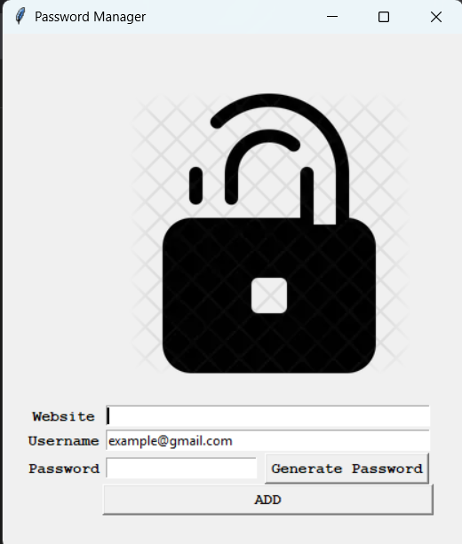

# Password Manager

Password Manager is built with Python's `tkinter` library that generates strong random passwords and saves website/username/password entries locally. This project was built to practice GUI development and file handling.

  
<h3>Click to view screenshot</h3>

  

## Features

The app is split into two files: `main.py` handles the GUI and file-saving logic, while `password_generator.py` handles password creation.

* **Password Generation:** `password_generator.py` builds three separate lists (letters, numbers, symbols) with random lengths, combines them into one list. Then, shuffles it with `random.shuffle()`, and joins it into a single password string that's imported into `main.py`.
* **Form Validation:** `add_password()` After checking the length of the `website` and `password` fields, `mbox.showinfo()` warns the user with a popup if the website or password field is left empty before saving.
* **Confirm Before Save:** If validation passes, `mbox.askokcancel()` shows a summary popup. The entry is only written to the CSV file if the user clicks "OK".
* **Local Storage:** Confirmed entries are appended to `saving.csv` in `website | username | password` format.

## Concepts Learned & Applied (Tkinter)

* **`Tk`:** The root window (`screen = Tk()`) that initializes the application and acts as the parent container for every other widget.
* **Canvas:** A drawing surface used to display the lock image above the input form.
* **Grid Layout:** Using `.grid()` with `column`, `row`, and `columnspan` to arrange labels, entries, and buttons into a structured form.
* **Entry Widgets:** Using `Entry` for user input, along with `.insert()` to pre-fill default text and `.delete(0, END)` to clear fields after submission.
* **Separation of Concerns:** Keeping password generation logic in its own module (`password_generator.py`) and importing it into `main.py`, rather than mixing generation logic with the GUI code.
* **File I/O:** Using Python's built-in `open()` with append mode (`"a"`) to persist data across sessions without needing a database.
