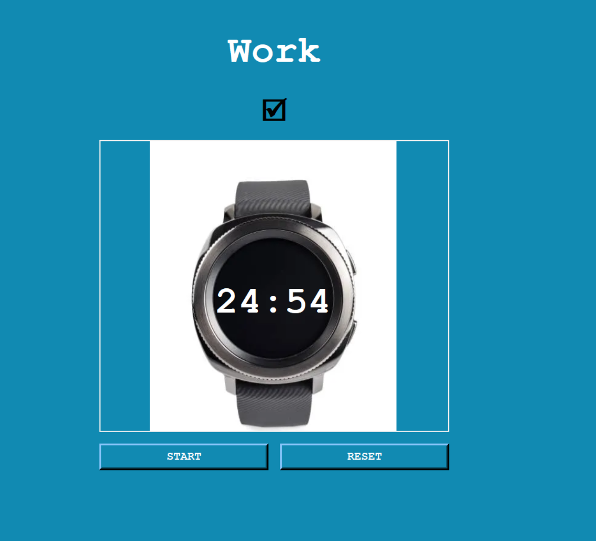

# Pomodoro Clock

Pomodoro Clock is a timer built with Python's `tkinter` library, based on the Pomodoro Technique. This project was built to practice GUI development and event-driven programming.

## Features

* **Work/Break Cycle:** Automatically alternates between a 25-minute work session, a 5-minute short break, and a 20-minute long break every 4th session.
* **Live Countdown:** Updates the on-screen timer every second using `after()` to schedule recurring calls without blocking the GUI.
* **Progress Tracking:** Displays a checkmark (🗹) for every completed work session, so progress is visible.
* **Reset Control:** Cancels the running timer and resets the count, label, checkmarks, and clock display back to their starting state.

## Logic

The timer logic is around a `reps` counter that controls the work/short-break/long-break pattern.

* **Simple Buttons:** Click **START** to begin a work session. Click **RESET** to stop the timer and clear all progress.
* **Session Counter:** A global `reps` variable increments on every `start_timer()` call and determines whether the app is in a work, short break, or long break state using modulo logic (`reps % 8`, `reps % 2`).
* **Looping Countdown:** `count_down()` calls itself via `screen.after()`, and once it hits zero, it automatically triggers the next `start_timer()` call which helps to chain sessions without manual restarts.

## Concepts Learned & Applied (Tkinter)

* **`Tk`:** The root window (`screen = Tk()`) that initializes the application and acts as the parent container for every other widget.
* **`Canvas`:** A drawing surface used here to layer the watch image and the countdown text (`create_image`, `create_text`) at exact coordinates.
* **`Frame`:** A layout container (`btn_frame`) used to group the START and RESET buttons together so they can be positioned as one unit with `pack()`.
* **Widget Configuration:** Using `.config()` to dynamically update label text (`title_label`, `check_mark`) and `canvas.itemconfig()` to update canvas items after creation.
* **Event Scheduling:** Using `screen.after()` and `screen.after_cancel()` to run and stop a repeating countdown without freezing the GUI.
* **Global State Management:** Using `global` keyword to modify `reps` and `timer` across multiple functions.
